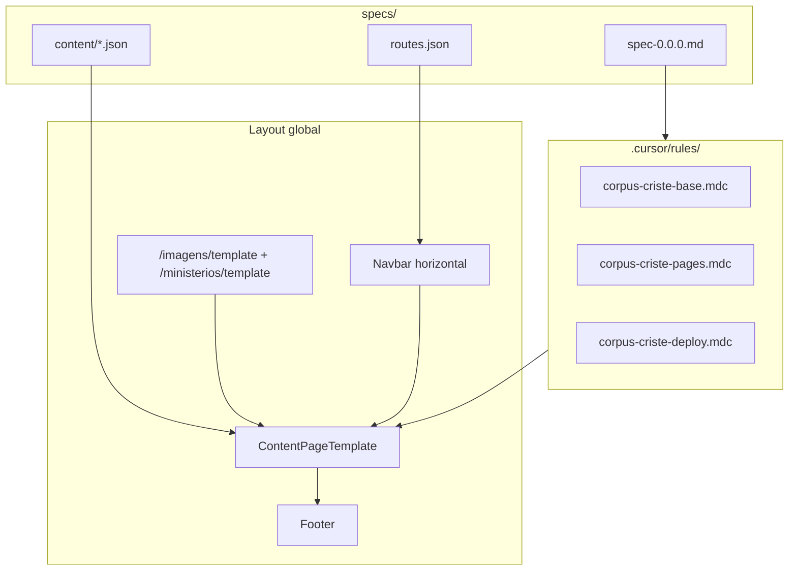

# Template base editável + Navbar horizontal + Documentação v0.0.0

## Contexto do projeto

O site é **Next.js 16 App Router** com conteúdo versionado em [`specs/`](specs/). Cada página carrega JSON via [`loadContent()`](lib/specs/loader.ts) e repete manualmente a mesma estrutura visual.

**Padrões identificados hoje:**

| Padrão | Páginas | Estrutura |
|--------|---------|-----------|
| Hero + cards | Home, Nossa Senhora Auxiliadora | `HeroSection` (foto de fundo) + `ContentCard` por seção |
| Listagem em grid | Imagens, Ministérios | Hero gradiente inline + cards linkáveis |
| Landing custom | DEA Ajuda | Seções próprias (mantém fora do template base) |

**Navbar atual:** [`components/layout/Navbar.tsx`](components/layout/Navbar.tsx) usa Select dropdown. Será substituída por links horizontais com submenus.



---

## Parte 1 — Modelo base editável (só conteúdo)

### Objetivo

Criar componentes reutilizáveis para que **novas páginas exijam apenas um JSON** (texto, hero, foto de fundo) — sem duplicar JSX de layout.

### Novos componentes

**1. [`components/layout/PageShell.tsx`](components/layout/PageShell.tsx)**  
Wrapper comum: `<main className="min-h-screen bg-[#0f0f12] text-[#f2f2f2]">`.

**2. [`components/content/ContentPageTemplate.tsx`](components/content/ContentPageTemplate.tsx)**  
Template principal para páginas “hero + seções”:

- Recebe `hero` (`backgroundImage`, `overlay`, `logo`, título, subtítulo, citação)
- Recebe `sections[]` do JSON
- Renderiza `HeroSection` + container `max-w-[1100px]`
- Prop `compact?: boolean` para hero menor

**3. [`components/content/SectionRenderer.tsx`](components/content/SectionRenderer.tsx)**  
Mapeia tipos de [`lib/specs/types.ts`](lib/specs/types.ts):

- `paragraphs` → `ContentCard` + parágrafos + quote + CTA
- `card` → mesmo padrão
- `quote` → bloco lateral dourado

**4. [`components/content/ListingPageTemplate.tsx`](components/content/ListingPageTemplate.tsx)**  
Extrai código duplicado de Imagens e Ministérios:

- Hero com título/subtítulo
- Gradiente `gold` (Imagens) ou `wine` (Ministérios)
- Opcional: `backgroundImage` no hero
- Grid de cards com `available` / “Em breve”

**5. Schema genérico `contentPageSchema` em [`lib/specs/types.ts`](lib/specs/types.ts)**  
Unifica o schema de páginas hero+seções (home, NSA, templates). Slugs registrados no loader.

### Refatoração das páginas existentes

| Arquivo | Mudança |
|---------|---------|
| [`app/page.tsx`](app/page.tsx) | `ContentPageTemplate` |
| [`app/imagens/nossa-senhora-auxiliadora/page.tsx`](app/imagens/nossa-senhora-auxiliadora/page.tsx) | `ContentPageTemplate` compact |
| [`app/imagens/page.tsx`](app/imagens/page.tsx) | `ListingPageTemplate` |
| [`app/ministerios/page.tsx`](app/ministerios/page.tsx) | `ListingPageTemplate` |
| [`app/ministerios/dea-ajuda/page.tsx`](app/ministerios/dea-ajuda/page.tsx) | **Sem alteração** |

### Foto de fundo

Centralizada em `HeroSection` via `hero.backgroundImage` + `overlay` no JSON. Editar conteúdo = editar JSON + `npm run test:specs`.

---

## Parte 2 — Páginas-template (modelo aprovado por aba)

### Objetivo

Criar **uma página de referência viva** em cada aba — ponto de partida obrigatório para novos projetos. Agentes e editores copiam o JSON e o `page.tsx` mínimo destas páginas.

### Rotas novas

| Rota | Arquivo page | JSON de conteúdo | Uso |
|------|--------------|------------------|-----|
| `/imagens/template` | [`app/imagens/template/page.tsx`](app/imagens/template/page.tsx) | [`specs/content/imagens-template.json`](specs/content/imagens-template.json) | Modelo para novas devoções/galerias |
| `/ministerios/template` | [`app/ministerios/template/page.tsx`](app/ministerios/template/page.tsx) | [`specs/content/ministerios-template.json`](specs/content/ministerios-template.json) | Modelo para novos ministérios |

Ambas usam **`ContentPageTemplate`** (hero com foto + seções). Conteúdo placeholder explica que é o modelo aprovado e lista os campos editáveis.

### `page.tsx` mínimo (padrão aprovado — copiar exatamente)

```tsx
import type { Metadata } from 'next'
import { ContentPageTemplate } from '@/components/content/ContentPageTemplate'
import { loadContent } from '@/lib/specs/loader'

const content = loadContent('imagens-template') // ou 'ministerios-template'

export const metadata: Metadata = {
  title: content.meta.title,
  description: content.meta.description,
}

export default function Page() {
  return <ContentPageTemplate content={content} compact />
}
```

**Regra:** novas páginas NÃO inventam layout — copiam este `page.tsx` e trocam apenas o slug.

### Atualizações em specs

**[`specs/routes.json`](specs/routes.json)** — adicionar entradas com `parent`:

```json
{ "label": "Modelo (Imagens)", "path": "/imagens/template", "parent": "/imagens" },
{ "label": "Modelo (Ministérios)", "path": "/ministerios/template", "parent": "/ministerios" }
```

**[`specs/content/imagens.json`](specs/content/imagens.json)** e **[`specs/content/ministerios.json`](specs/content/ministerios.json)** — adicionar card na listagem apontando para `/imagens/template` e `/ministerios/template` (`available: true`, emoji 📋).

**Navbar dropdowns** passam a exibir:

```
Imagens ▾                    Ministérios ▾
  Nossa Senhora Auxiliadora    DEA Ajuda
  Modelo (Imagens)             Modelo (Ministérios)
```

---

## Parte 3 — Navbar horizontal com dropdowns

Substituir Select por **Home | Imagens ▾ | Ministérios ▾**.

- Helper [`lib/specs/nav.ts`](lib/specs/nav.ts): `buildNavTree()`, `resolveActivePath()`
- Componente [`components/layout/NavDropdown.tsx`](components/layout/NavDropdown.tsx): hover + focus-within + estado ativo em rotas filhas
- Mobile: menu expansível (evita overflow)
- Remover dependência do Select na navbar (componente ui/select pode permanecer no projeto)

---

## Parte 4 — Documentação de versão: `specs/spec-0.0.0.md`

### Objetivo

Arquivo de release com **resumo completo** desta entrega. Referência histórica do que mudou na baseline v0.0.0.

### Conteúdo do arquivo [`specs/spec-0.0.0.md`](specs/spec-0.0.0.md)

```markdown
# CorpusCriste — Spec v0.0.0

releasedAt: 2026-06-01
approvedBy: Grupo Deus É Amor

## Resumo

Esta versão estabelece o modelo aprovado de páginas editáveis por JSON,
navbar horizontal com submenus, páginas-template de referência e
documentação para agentes Cursor.

## Entregas

1. Componentes de template (PageShell, ContentPageTemplate, SectionRenderer, ListingPageTemplate)
2. Refatoração das páginas existentes para usar templates
3. Navbar horizontal: Home, Imagens (dropdown), Ministérios (dropdown)
4. Páginas-modelo: /imagens/template, /ministerios/template
5. Regras Cursor em .cursor/rules/
6. Testes e checklist atualizados

## Modelo aprovado

- Páginas de conteúdo: ContentPageTemplate + JSON em specs/content/
- Páginas de listagem: ListingPageTemplate + JSON
- Exceção: DEA Ajuda (layout custom, não usar template genérico)
- Sempre copiar de imagens-template ou ministerios-template

## Rotas desta versão

| Rota | Tipo |
|------|------|
| / | ContentPageTemplate |
| /imagens | ListingPageTemplate |
| /imagens/nossa-senhora-auxiliadora | ContentPageTemplate |
| /imagens/template | ContentPageTemplate (MODELO) |
| /ministerios | ListingPageTemplate |
| /ministerios/dea-ajuda | Custom |
| /ministerios/template | ContentPageTemplate (MODELO) |

## Redirects Vercel (vercel.json)

- /dea-ajuda → /ministerios/dea-ajuda
- /nossa-senhora-auxiliadora → /imagens/nossa-senhora-auxiliadora

## Checklist de aceite

Referência: specs/tests/checklist.json
```

### Atualizar [`specs/version.json`](specs/version.json)

```json
{
  "contentVersion": "0.0.0",
  "releasedAt": "2026-06-01",
  "approvedBy": "Grupo Deus É Amor",
  "specFile": "spec-0.0.0.md"
}
```

---

## Parte 5 — Documentação Cursor (`.cursor/rules/`)

Agentes devem **sempre usar o modelo aprovado** — nunca criar layout ad hoc.

### Estrutura

```
.cursor/
└── rules/
    ├── corpus-criste-base.mdc      # alwaysApply: true
    ├── corpus-criste-pages.mdc     # globs: app/**/page.tsx, specs/content/**
    └── corpus-criste-deploy.mdc    # globs: vercel.json, specs/routes.json
```

### [`corpus-criste-base.mdc`](.cursor/rules/corpus-criste-base.mdc) — alwaysApply

Conteúdo relevante para agentes:

- Projeto content-first: editar `specs/content/*.json`, validar com `npm run test:specs`
- **Modelo aprovado obrigatório:** copiar de `/imagens/template` ou `/ministerios/template`
- Componentes permitidos: `ContentPageTemplate`, `ListingPageTemplate`, `PageShell`
- Proibido: duplicar JSX de hero/cards nas pages; criar novos padrões visuais
- Identidade: fundo `#0f0f12`, dourado `#d4af37`, serif Cormorant, rounded-2xl
- Versão atual: ler `specs/spec-0.0.0.md` e `specs/version.json`

### [`corpus-criste-pages.mdc`](.cursor/rules/corpus-criste-pages.mdc)

Detalhes por tipo de página:

| Página | Template | JSON | Notas |
|--------|----------|------|-------|
| Home | ContentPageTemplate | home.json | Hero fullscreen, 2 seções highlight |
| Imagens (index) | ListingPageTemplate | imagens.json | Gradiente gold, grid galleries |
| NSA | ContentPageTemplate compact | nossa-senhora-auxiliadora.json | Seções card + quote |
| **Imagens template** | ContentPageTemplate compact | imagens-template.json | **COPIAR ESTE** |
| Ministérios (index) | ListingPageTemplate | ministerios.json | Gradiente wine |
| DEA Ajuda | Custom (não copiar) | dea-ajuda.json | Layout especial |
| **Ministérios template** | ContentPageTemplate compact | ministerios-template.json | **COPIAR ESTE** |

Fluxo para nova página:

1. Copiar JSON de `imagens-template.json` ou `ministerios-template.json`
2. Copiar `app/imagens/template/page.tsx` (ou ministerios)
3. Registrar slug em `lib/specs/types.ts` + `loader.ts`
4. Adicionar rota em `specs/routes.json` com `parent`
5. Adicionar card em listagem (imagens.json ou ministerios.json)
6. Se URL antiga existir, adicionar redirect em `vercel.json`
7. Rodar `npm run test:specs` e `npm run test:e2e`

### [`corpus-criste-deploy.mdc`](.cursor/rules/corpus-criste-deploy.mdc)

**Rotas na Vercel:**

1. Rotas Next.js = estrutura de pastas em `app/` (App Router automático)
2. Redirects legados em [`vercel.json`](vercel.json):

```json
{
  "redirects": [
    { "source": "/slug-antigo", "destination": "/secao/novo-slug", "permanent": true }
  ]
}
```

3. Ao criar nova rota aninhada: `app/{secao}/{slug}/page.tsx`
4. Ao renomear URL pública: adicionar redirect permanente em `vercel.json`
5. Deploy: push para GitHub → Vercel detecta Next.js → `npm run build`
6. Cache de assets estáticos já configurado em `vercel.json`

**Nunca** configurar rotas só no Vercel sem espelhar em `app/` e `specs/routes.json`.

---

## Parte 6 — Testes e validação

| Arquivo | Ajuste |
|---------|--------|
| [`specs/tests/e2e/navigation.spec.ts`](specs/tests/e2e/navigation.spec.ts) | Navbar horizontal + dropdowns + rotas template |
| [`specs/tests/checklist.json`](specs/tests/checklist.json) | Itens nav, template pages, modelo aprovado |
| [`README.md`](README.md) | Navbar, templates, spec-0.0.0, .cursor/rules |
| [`lib/specs/loader.ts`](lib/specs/loader.ts) | Novos slugs `imagens-template`, `ministerios-template` |

```bash
npm run test:specs
npm run test:e2e
npm run build
```

---

## Escopo fora deste plano

- DEA Ajuda permanece layout custom
- Logo `/logo-deus-e-amor.png` ausente do `public/` — pré-existente
- Sem nova dependência Radix Navigation Menu
