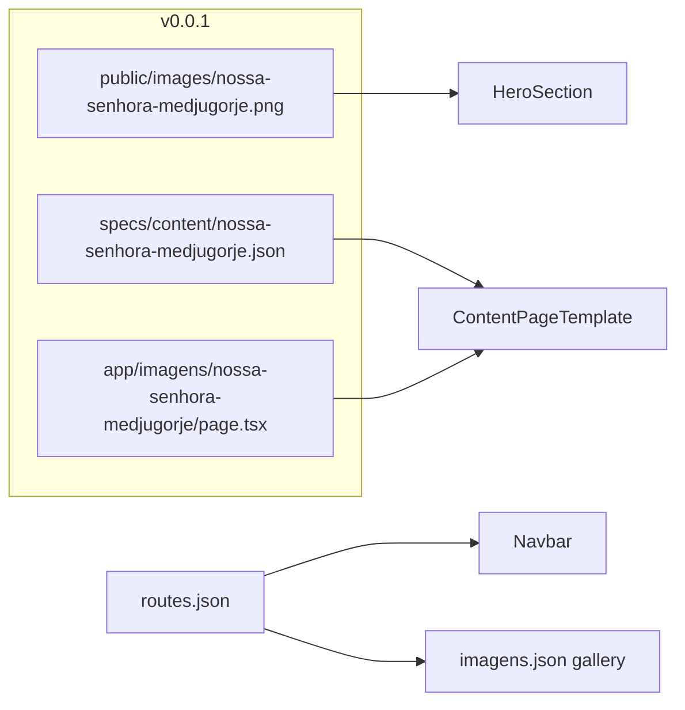

# CorpusCriste v0.0.1 — Nossa Senhora em Medjugorje

## Política de versionamento (nova documentação)

Estabelecer regra fixa para agentes:

**Cada versão `0.0.x` adiciona exatamente uma nova página de conteúdo**, usando sempre o modelo aprovado (`ContentPageTemplate` para Imagens/Ministérios).

| Versão | Página adicionada |
|--------|-------------------|
| 0.0.0 | Baseline: templates, navbar, páginas-modelo |
| **0.0.1** | **Nossa Senhora em Medjugorje** (`/imagens/nossa-senhora-medjugorje`) |

Checklist obrigatório por versão:

1. Criar JSON em `specs/content/`
2. Criar `app/.../page.tsx` mínimo (copiar de [`app/imagens/template/page.tsx`](app/imagens/template/page.tsx))
3. Registrar slug em [`lib/specs/types.ts`](lib/specs/types.ts) + [`lib/specs/loader.ts`](lib/specs/loader.ts)
4. Adicionar rota em [`specs/routes.json`](specs/routes.json) com `parent`
5. Adicionar card na listagem ([`specs/content/imagens.json`](specs/content/imagens.json))
6. Criar `specs/spec-0.0.x.md` com resumo da entrega
7. Atualizar [`specs/version.json`](specs/version.json) (`contentVersion`, `specFile`, `releasedAt`)
8. Atualizar regras Cursor + README
9. Rodar `npm run test:specs`, `npm run build`, `npm run test:e2e`

Documentar em:
- [`specs/spec-0.0.1.md`](specs/spec-0.0.1.md) — release notes desta versão
- [`.cursor/rules/corpus-criste-versions.mdc`](.cursor/rules/corpus-criste-versions.mdc) — regra `alwaysApply: false`, referenciada em `corpus-criste-base.mdc`
- Atualizar [`.cursor/rules/corpus-criste-pages.mdc`](.cursor/rules/corpus-criste-pages.mdc) — tabela de páginas + nova linha Medjugorje
- Atualizar [`README.md`](README.md) — seção "Versionamento" e nova rota

---

## Nova página: Nossa Senhora em Medjugorje

### Rota e arquivos

| Item | Valor |
|------|-------|
| Slug | `nossa-senhora-medjugorje` |
| URL | `/imagens/nossa-senhora-medjugorje` |
| Template | `ContentPageTemplate` compact |
| JSON | [`specs/content/nossa-senhora-medjugorje.json`](specs/content/nossa-senhora-medjugorje.json) |
| Page | [`app/imagens/nossa-senhora-medjugorje/page.tsx`](app/imagens/nossa-senhora-medjugorje/page.tsx) |

`page.tsx` — copiar exatamente o padrão de [`app/imagens/nossa-senhora-auxiliadora/page.tsx`](app/imagens/nossa-senhora-auxiliadora/page.tsx), trocando slug.

### Imagem de fundo

Copiar a imagem anexada:

- **De:** `.cursor/projects/.../assets/image-ef120f1c-2fa1-4171-8b3d-8437a742ec77.png`
- **Para:** [`public/images/nossa-senhora-medjugorje.png`](public/images/nossa-senhora-medjugorje.png)

No JSON do hero:

```json
"backgroundImage": "/images/nossa-senhora-medjugorje.png",
"overlay": "linear-gradient(rgba(0,0,0,0.75), rgba(0,0,0,0.88))"
```

Overlay mais forte que NSA — a foto é clara e rochosa; garante legibilidade do texto no hero.

Hero sugerido:
- **title:** "Aparições de Nossa Senhora em Medjugorje"
- **subtitle:** "Medjugorje, Bósnia e Herzegovina — desde 24 de junho de 1981"
- **quote:** "Paz, paz, paz – e somente paz! A paz deve reinar entre Deus e o homem e entre os homens!"
- **logo:** manter logo do grupo (padrão NSA) para consistência visual

### Organização do conteúdo (6 cards + citação final)

Dividir o texto fornecido em seções `type: "card"`, preservando o texto integral do usuário:

| Seção | Título | Conteúdo |
|-------|--------|----------|
| 1 | Medjugorje: de aldeia simples a lugar de graça | Intro sobre a vila e 24/06/1981 |
| 2 | Os primeiros videntes | Ivanka/Mirjana, seis jovens no dia 24, oito no dia 25, aparições diárias |
| 3 | A mensagem da paz | 26/06/1981 + reunião com dom Pavao Zanić (21/07) |
| 4 | Perseguições e fidelidade | Investigações, Frei Jozo detido, perseverança dos videntes |
| 5 | Um centro de oração mundial | 20 milhões de visitas, mensagens (PAZ, FÉ, CONVERSÃO, ORAÇÃO, JEJUM) |
| 6 | Testemunhas da paróquia | Locuções 1982, grupo de oração 1983–1987, mensagem de 01/03/1984 |
| 7 | A Igreja e o legado | Vaticano 2015/2019, conclusão sobre fé, amor, paz, jejum e conversão |

Última seção inclui `quote` com a mensagem final. Corrigir typo do usuário "Medjugorge" → "Medjugorje" no texto.

---

## Atualizações em specs e registro

### [`specs/routes.json`](specs/routes.json)

```json
{
  "label": "Nossa Senhora em Medjugorje",
  "path": "/imagens/nossa-senhora-medjugorje",
  "parent": "/imagens"
}
```

(inserir após Nossa Senhora Auxiliadora, antes do Modelo)

### [`specs/content/imagens.json`](specs/content/imagens.json)

Novo card na galeria:

```json
{
  "slug": "nossa-senhora-medjugorje",
  "title": "Nossa Senhora em Medjugorje",
  "description": "As aparições de Nossa Senhora em Medjugorje desde 1981.",
  "path": "/imagens/nossa-senhora-medjugorje",
  "emoji": "✨",
  "available": true
}
```

### [`lib/specs/types.ts`](lib/specs/types.ts) + [`lib/specs/loader.ts`](lib/specs/loader.ts)

- Adicionar `nossaSenhoraMedjugorjeContentSchema` (extends `contentPageSchema`, slug literal)
- Adicionar `'nossa-senhora-medjugorje'` ao union `ContentSlug`
- Registrar case no loader e em `validateAllSpecs()`

### [`specs/version.json`](specs/version.json)

```json
{
  "contentVersion": "0.0.1",
  "releasedAt": "2026-06-01",
  "approvedBy": "Grupo Deus É Amor",
  "specFile": "spec-0.0.1.md"
}
```

### [`specs/tests/checklist.json`](specs/tests/checklist.json)

- Atualizar `"version": "0.0.1"`
- Adicionar item: `"medjugorje-content"` — página Medjugorje com hero, cards e texto aprovado

Testes e2e de navegação em [`specs/tests/e2e/navigation.spec.ts`](specs/tests/e2e/navigation.spec.ts) **não precisam de alteração manual** — carregam rotas de `routes.json` dinamicamente.

---

## Fluxo visual



---

## Escopo fora desta versão

- Sem redirect legado (URL nova, sem slug antigo)
- DEA Ajuda e páginas-modelo permanecem inalteradas
- Sem alteração de layout ou componentes — só conteúdo + documentação
