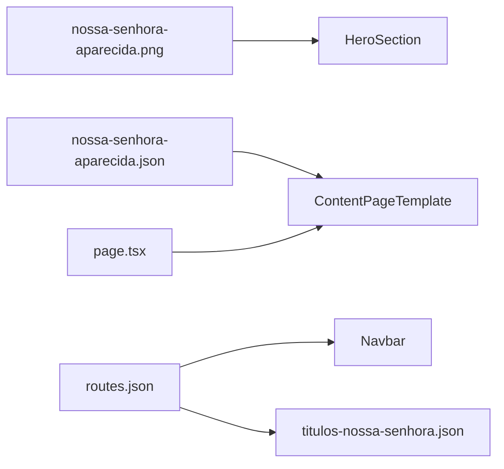

# CorpusCriste v0.0.2 — Nossa Senhora Aparecida

## Política de versionamento (atualizar)

Seguir [`.cursor/rules/corpus-criste-versions.mdc`](.cursor/rules/corpus-criste-versions.mdc): **uma página por versão `0.0.x`**.

| Versão | Página |
|--------|--------|
| 0.0.1 | Nossa Senhora em Medjugorje |
| **0.0.2** | **Nossa Senhora Aparecida** |

Checklist obrigatório (9 passos) + criar [`specs/spec-0.0.2.md`](specs/spec-0.0.2.md) e bump [`specs/version.json`](specs/version.json) para `0.0.2`.

---

## Nova página

| Item | Valor |
|------|-------|
| Slug | `nossa-senhora-aparecida` |
| URL | `/titulos-nossa-senhora/nossa-senhora-aparecida` |
| Template | `ContentPageTemplate` compact (igual [Medjugorje](app/titulos-nossa-senhora/nossa-senhora-medjugorje/page.tsx)) |
| JSON | [`specs/content/nossa-senhora-aparecida.json`](specs/content/nossa-senhora-aparecida.json) |
| Page | [`app/titulos-nossa-senhora/nossa-senhora-aparecida/page.tsx`](app/titulos-nossa-senhora/nossa-senhora-aparecida/page.tsx) |

### Imagens

| Arquivo | Uso |
|---------|-----|
| `assets/image-08b683b0-...png` → [`public/images/nossa-senhora-aparecida.png`](public/images/nossa-senhora-aparecida.png) | **Hero** (estátua na basílica, coroa e manto) |
| `assets/image-fb49d864-...png` → [`public/images/nossa-senhora-aparecida-pescadores.png`](public/images/nossa-senhora-aparecida-pescadores.png) | Referência guardada no repo; **não** entra no template hoje (sem tipo `image` em seções) |

O modelo aprovado ([`SectionRenderer`](components/content/SectionRenderer.tsx)) só renderiza texto em cards. A **pintura dos pescadores** será incorporada como **descrição narrativa e visual** na seção “O achado no rio Paraíba do Sul”, citando cena das canoas, rede, corpo e cabeça da imagem — sem alterar componentes nesta versão.

### Hero (JSON)

```json
{
  "title": "Nossa Senhora Aparecida",
  "subtitle": "Padroeira do Brasil — 12 de outubro de 1717",
  "quote": "Nossa Senhora Aparecida, o Brasil é vosso. Cuidai do Brasil.",
  "backgroundImage": "/images/nossa-senhora-aparecida.png",
  "overlay": "linear-gradient(rgba(0,0,0,0.75), rgba(0,0,0,0.88))"
}
```

Logo do grupo (padrão NSA/Medjugorje) para consistência.

### Estrutura do conteúdo (5 cards + citação)

Texto base do usuário na **primeira seção**; demais seções sintetizam o artigo [Canção Nova — Nossa Senhora Aparecida, a luz da história do Brasil](https://formacao.cancaonova.com/espiritualidade/nossa-senhora-aparecida-luz-da-historia-brasil/) (já salvo em `uploads/nossa-senhora-aparecida-luz-da-historia-brasil-0.md`), em linguagem própria e resumida:

| # | Título | Conteúdo |
|---|--------|----------|
| 1 | Padroeira do Brasil | Texto fornecido pelo usuário (12/10/1717, Paraíba do Sul, milagres, símbolo de fé/esperança/proteção) |
| 2 | O achado no rio Paraíba do Sul | **Descrição visual** (inspirada na pintura): três pescadores em canoas no rio calmo; um ergue a pequena imagem escura. **História** (Canção Nova): João Alves, Felipe Pedroso e Domingos Garcia; pedido do Conde de Assumar (sexta-feira sem carne); noite sem peixe; corpo da imagem em Itaguaçu; cabeça presa na rede em Correia Leite; pesca abundante |
| 3 | Uma imagem que fala sem palavras | Imagem de barro século XVII (~36 cm); Nossa Senhora da Conceição Aparecida; símbolos (túnica, manto, gesto de oração); silêncio da aparição |
| 4 | Da devoção popular à Basílica | Oratório na casa de Felipe Pedroso; Athanásio Pedroso; milagre das velas; capela em 1745; acolhida dos fiéis e escravos na construção |
| 5 | Rainha do coração brasileiro | Coroa e manto da Princesa Isabel (1888); São Pio X (1904); Pio XI padroeira (1911); consagração do Brasil pelo Cardeal Leme (1931) |

Última seção com `quote` sobre fé, esperança e proteção do povo brasileiro.

**Nota editorial:** incluir no `spec-0.0.2.md` referência à fonte Canção Nova para agentes futuros; não copiar o artigo integral.

---

## Registros e integração

### Arquivos novos

- `specs/content/nossa-senhora-aparecida.json`
- `app/titulos-nossa-senhora/nossa-senhora-aparecida/page.tsx`
- `public/images/nossa-senhora-aparecida.png`
- `public/images/nossa-senhora-aparecida-pescadores.png` (asset de apoio)
- `specs/spec-0.0.2.md`

### Arquivos alterados

| Arquivo | Alteração |
|---------|-----------|
| [`lib/specs/types.ts`](lib/specs/types.ts) | `nossaSenhoraAparecidaContentSchema`, slug em `ContentSlug` |
| [`lib/specs/loader.ts`](lib/specs/loader.ts) | case + `validateAllSpecs()` |
| [`specs/routes.json`](specs/routes.json) | entrada com `parent: "/titulos-nossa-senhora"` |
| [`specs/content/titulos-nossa-senhora.json`](specs/content/titulos-nossa-senhora.json) | card na galeria (emoji sugerido: estrela ou coração) |
| [`specs/version.json`](specs/version.json) | `0.0.2`, `specFile: spec-0.0.2.md` |
| [`specs/tests/checklist.json`](specs/tests/checklist.json) | versão + item `aparecida-content` |
| [`.cursor/rules/corpus-criste-versions.mdc`](.cursor/rules/corpus-criste-versions.mdc) | linha 0.0.2 |
| [`.cursor/rules/corpus-criste-pages.mdc`](.cursor/rules/corpus-criste-pages.mdc) | linha Aparecida |
| [`README.md`](README.md) | rota + tabela versionamento |

### Testes

- E2E de navegação: **sem alteração manual** (lê `routes.json` dinamicamente)
- Rodar: `npm run test:specs`, `npm run build`, `npm run test:e2e`

---

## Fluxo



---

## Fora do escopo

- Novo tipo de seção com imagem inline (pintura só em texto nesta versão)
- Redirect legado (URL nova)
- Alteração em DEA Ajuda ou páginas-modelo
