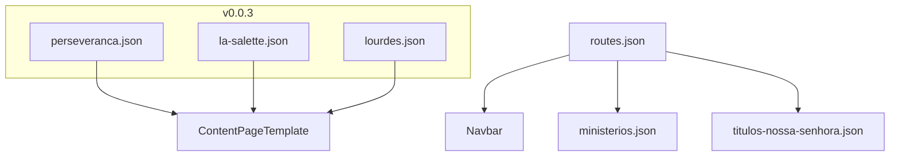

# CorpusCriste v0.0.3 — Perseverança, La Salette e Lourdes

## Escopo desta versão

Três páginas **sem ligação entre si**, cada uma no modelo aprovado (`ContentPageTemplate` compact + JSON). Esta versão **excepciona** a regra “1 página por versão” — documentar em [`specs/spec-0.0.3.md`](specs/spec-0.0.3.md) e [`.cursor/rules/corpus-criste-versions.mdc`](.cursor/rules/corpus-criste-versions.mdc).

| Página | Seção | Rota | Slug |
|--------|-------|------|------|
| Ministério Perseverança | Ministérios | `/ministerios/perseveranca` | `perseveranca` |
| Nossa Senhora de La Salette | Títulos de Nossa Senhora | `/titulos-nossa-senhora/nossa-senhora-la-salette` | `nossa-senhora-la-salette` |
| Nossa Senhora de Lourdes | Títulos de Nossa Senhora | `/titulos-nossa-senhora/nossa-senhora-lourdes` | `nossa-senhora-lourdes` |

**Modelo:** copiar [`app/ministerios/template/page.tsx`](app/ministerios/template/page.tsx) ou [`app/titulos-nossa-senhora/nossa-senhora-aparecida/page.tsx`](app/titulos-nossa-senhora/nossa-senhora-aparecida/page.tsx) — apenas trocar o slug. **Não** usar layout custom de DEA Ajuda.

---

## Imagens (assets anexados → `public/images/`)

| Asset anexo | Destino | Uso |
|-------------|---------|-----|
| `image-5fb9a2b1-...png` | `ministerio-perseveranca.png` | Hero **e** referência visual na seção destacada do grupo |
| `image-2d30bcdb-...png` | `nossa-senhora-la-salette.png` | Hero La Salette |
| `image-725a5c4d-...png` | `nossa-senhora-lourdes.png` | Hero Lourdes |

O template aprovado **não** suporta imagem inline em cards ([`SectionRenderer`](components/content/SectionRenderer.tsx)). Para Perseverança:

- **Fundo da página:** `hero.backgroundImage` = foto do grupo + overlay forte (legibilidade)
- **Lugar especial:** primeira seção `variant: "highlight"` titulada **“Nosso grupo de servos”** com descrição visual da foto (jovens reunidos sob telhado, expressão acolhedora) + missão do ministério — o visitante vê a mesma imagem no hero e lê quem são no card logo abaixo

---

## Conteúdo por página

### 1. Ministério Perseverança — [`specs/content/perseveranca.json`](specs/content/perseveranca.json)

**Hero:**
- title: `Ministério Perseverança`
- subtitle: `Formar servos gentis e generosos do amor de Deus`
- quote: texto sobre perseverar no caminho de servir
- backgroundImage: `/images/ministerio-perseveranca.png`
- logo: padrão Grupo Deus É Amor

**Seções sugeridas (4 cards):**
1. **O Ministério Perseverança** (highlight) — novos servos dedicados a aprender e perseverar no serviço a Deus; objetivo de formar servos gentis e generosos
2. **Nosso grupo de servos** (highlight) — descrição visual da foto do grupo + sentido de comunidade e formação
3. **Caminho do servir** — aprendizado, dedicação, perseverança na vocação
4. **Chamado** — quote final sobre servir com amor e generosidade

### 2. Nossa Senhora de La Salette — [`specs/content/nossa-senhora-la-salette.json`](specs/content/nossa-senhora-la-salette.json)

**Hero:** pintura La Salette, subtitle `19 de setembro de 1846 — Alpes franceses`

**Seções (3 cards):**
1. **A aparição em La Salette** — texto do usuário (Maximino e Melanie, globo de luz, senhora chorando sobre a pedra); corrigir typos (`tristeza`, `La Salette`)
2. **A mensagem da Mãe que chora** — “Vinde, meus filhos, não temais…”, braço do Filho, pedido de transmitir ao povo
3. **Uma mãe que chora por seus filhos** — símbolo da devoção + quote

### 3. Nossa Senhora de Lourdes — [`specs/content/nossa-senhora-lourdes.json`](specs/content/nossa-senhora-lourdes.json)

**Hero:** pintura Lourdes, subtitle `1858 — Gruta de Massabielle, França`

**Seções (3 cards):**
1. **Bernadette e a gruta** — texto do usuário (busca de lenha, senhora vestida de branco, rosário)
2. **“Sou a Imaculada Conceição”** — 18 aparições, fonte milagrosa que ainda existe
3. **Mensagem de Lourdes** — conversão, oração, penitência, confiança em Deus, doentes e humildes + quote

---

## Registro e integração (checklist × 3)

Para **cada** página, repetir o fluxo aprovado:

1. JSON em `specs/content/`
2. `app/.../page.tsx` mínimo
3. Schema + slug em [`lib/specs/types.ts`](lib/specs/types.ts) e [`lib/specs/loader.ts`](lib/specs/loader.ts)
4. Entrada em [`specs/routes.json`](specs/routes.json) com `parent`
5. Card em [`specs/content/ministerios.json`](specs/content/ministerios.json) ou [`specs/content/titulos-nossa-senhora.json`](specs/content/titulos-nossa-senhora.json)

**routes.json** — adicionar após entradas existentes de cada seção:

```json
{ "label": "Perseverança", "path": "/ministerios/perseveranca", "parent": "/ministerios" },
{ "label": "Nossa Senhora de La Salette", "path": "/titulos-nossa-senhora/nossa-senhora-la-salette", "parent": "/titulos-nossa-senhora" },
{ "label": "Nossa Senhora de Lourdes", "path": "/titulos-nossa-senhora/nossa-senhora-lourdes", "parent": "/titulos-nossa-senhora" }
```

**Listagens:**
- `ministerios.json`: card Perseverança (`available: true`, emoji cruz ou mãos)
- `titulos-nossa-senhora.json`: 2 cards (La Salette, Lourdes)

---

## Documentação v0.0.3

### [`specs/spec-0.0.3.md`](specs/spec-0.0.3.md) (nova)

- Resumo das 3 entregas
- Tabela de rotas e templates
- Nota: páginas independentes, sem links cruzados
- Assets e slugs
- Atualização da política: versões podem agrupar múltiplas páginas quando o release spec assim definir (v0.0.3 = 3 páginas)

### [`specs/version.json`](specs/version.json)

```json
{ "contentVersion": "0.0.2", ... } → "0.0.3", "specFile": "spec-0.0.3.md"
```

### Atualizar também

- [`.cursor/rules/corpus-criste-versions.mdc`](.cursor/rules/corpus-criste-versions.mdc) — histórico 0.0.3 (3 rotas)
- [`.cursor/rules/corpus-criste-pages.mdc`](.cursor/rules/corpus-criste-pages.mdc) — 3 linhas na tabela
- [`README.md`](README.md) — rotas + tabela versionamento
- [`specs/tests/checklist.json`](specs/tests/checklist.json) — `version: 0.0.3` + 3 itens: `perseveranca-content`, `la-salette-content`, `lourdes-content`

---

## Testes

- `npm run test:specs` — validar 3 novos JSONs + slugs
- `npm run build` — 14 rotas estáticas (11 + 3)
- `npm run test:e2e` — usar `CI=1` se houver `npm run start` stale na porta 3000; navegação lê `routes.json` automaticamente (+2 testes dropdown/mobile)

---

## Fluxo



---

## Fora do escopo

- Links entre as 3 páginas
- Novo tipo de seção com imagem inline
- Alteração em DEA Ajuda ou páginas-modelo
- Redirects legados (URLs novas)
