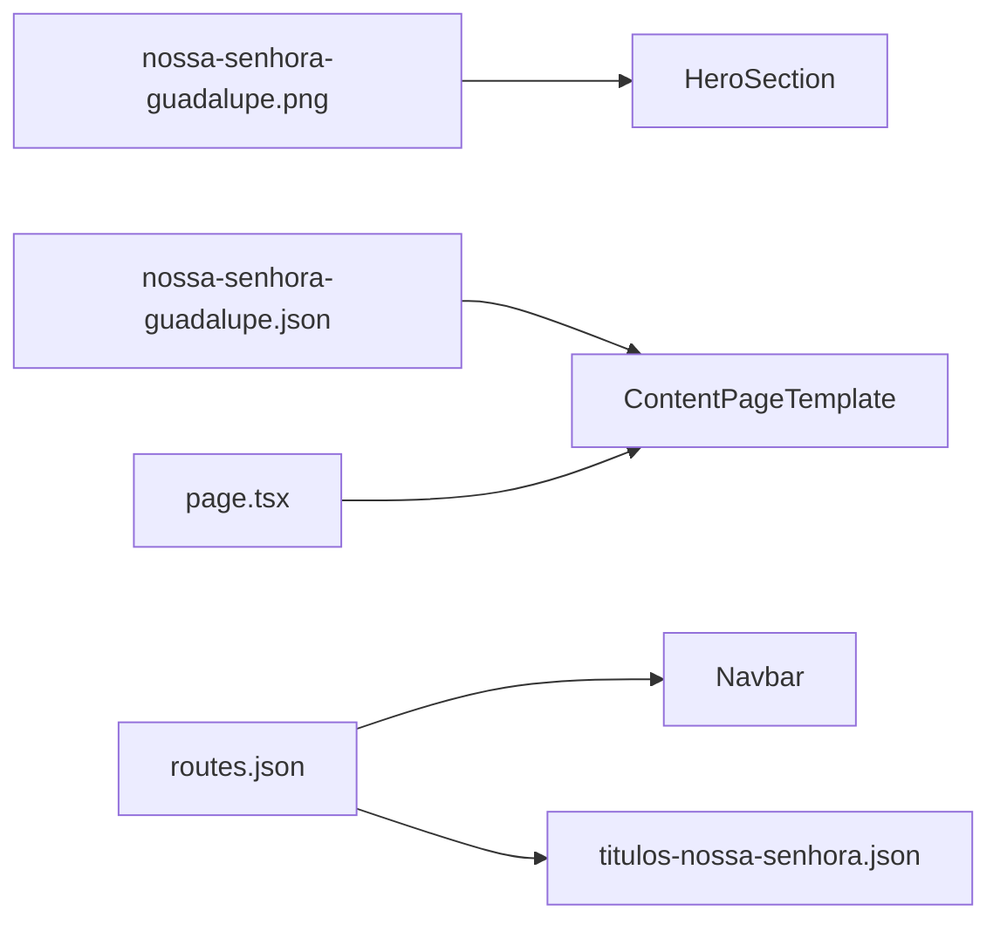

# CorpusCriste v0.0.4 — Nossa Senhora de Guadalupe

## Política de versionamento

Retoma a regra padrão ([`.cursor/rules/corpus-criste-versions.mdc`](.cursor/rules/corpus-criste-versions.mdc)): **uma página por `0.0.x`** (diferente da exceção v0.0.3).

| Versão | Página |
|--------|--------|
| 0.0.3 | Perseverança, La Salette, Lourdes |
| **0.0.4** | **Nossa Senhora de Guadalupe** |

Bump [`specs/version.json`](specs/version.json): `0.0.3` → `0.0.4`, `specFile: spec-0.0.4.md`.

---

## Nova página

| Item | Valor |
|------|-------|
| Slug | `nossa-senhora-guadalupe` |
| URL | `/titulos-nossa-senhora/nossa-senhora-guadalupe` |
| Template | `ContentPageTemplate` compact (copiar [`app/titulos-nossa-senhora/nossa-senhora-aparecida/page.tsx`](app/titulos-nossa-senhora/nossa-senhora-aparecida/page.tsx)) |
| JSON | [`specs/content/nossa-senhora-guadalupe.json`](specs/content/nossa-senhora-guadalupe.json) |
| Page | [`app/titulos-nossa-senhora/nossa-senhora-guadalupe/page.tsx`](app/titulos-nossa-senhora/nossa-senhora-guadalupe/page.tsx) |

### Imagens (hero)

O template não suporta imagem inline em cards ([`SectionRenderer`](components/content/SectionRenderer.tsx)) — apenas **hero** com `backgroundImage`, como Aparecida/Lourdes.

**Implementação recomendada (licença segura):**

| Arquivo destino | Fonte sugerida | Uso |
|-----------------|----------------|-----|
| [`public/images/nossa-senhora-guadalupe.png`](public/images/nossa-senhora-guadalupe.png) | [Wikimedia — Virgen de guadalupe1.jpg](https://commons.wikimedia.org/wiki/File:Virgen_de_guadalupe1.jpg) (domínio público, tilma) | Hero |
| `public/images/nossa-senhora-guadalupe-basilica.png` (opcional) | [Wikimedia — Virgen de Guadalupe en el Tepeyac.jpg](https://commons.wikimedia.org/wiki/File:Virgen_de_Guadalupe_en_el_Tepeyac.jpg) (CC BY-SA 4.0 — só se aceitar atribuição no spec) | Asset de apoio no repo; **não** entra no template nesta versão |

Os sites indicados (Canção Nova, Biblioteca Católica, Padre Paulo Ricardo) servem como **referência editorial** no `spec-0.0.4.md`; **não** extrair imagens deles (copyright). Se o usuário anexar PNG no chat, priorizar o asset anexo como nas versões anteriores.

### Hero (JSON)

```json
{
  "title": "Nossa Senhora de Guadalupe",
  "subtitle": "Padroeira da América Latina — 12 de dezembro de 1531",
  "quote": "Não estou eu aqui, que sou tua Mãe?",
  "backgroundImage": "/images/nossa-senhora-guadalupe.png",
  "overlay": "linear-gradient(rgba(0,0,0,0.75), rgba(0,0,0,0.88))",
  "logo": { "src": "/logo-deus-e-amor.png", "alt": "Grupo Deus É Amor", "width": 140, "height": 140 }
}
```

### Estrutura do conteúdo (5 cards + citação final)

Texto base: conteúdo fornecido pelo usuário, organizado em `paragraphs` (2–3 por card). Citações longas da Virgem ficam **dentro** do parágrafo ou no campo `quote` do último card.

| # | Título | `variant` | Conteúdo (resumo) |
|---|--------|-----------|-------------------|
| 1 | A Mãe que veio ao encontro dos povos da América | `highlight` | Dezembro 1531, Tepeyac, Juan Diego, missão do templo ao bispo Zumárraga |
| 2 | O sinal das rosas | — | Pedido de sinal; consolo ao tio; rosas castelhanas no inverno; tilma aberta diante do bispo (12/12/1531) |
| 3 | A imagem milagrosa | — | Tilma de agave preservada ~5 séculos; reflexos nos olhos; mensagem espiritual acima do científico |
| 4 | Padroeira da América Latina | — | Evangelização das Américas; Pio XII (1945); João Paulo II no México; Basílica e peregrinos |
| 5 | Uma mensagem que permanece atual | — | Mãe que acolhe os pequenos; `quote`: *"Não estou eu aqui, que sou tua Mãe?"* |

**Nota editorial:** datas e títulos papais seguem o texto do usuário (Pio XII, 1945). Incluir no spec referências a [Canção Nova](https://santo.cancaonova.com/santo/nossa-senhora-de-guadalupe-a-padroeira-da-america-latina/) e [Biblioteca Católica](https://bibliotecacatolica.com.br/blog/devocao/nossa-senhora-de-guadalupe/) para agentes futuros; não copiar artigos integrais.

---

## Registros e integração (checklist padrão)

### Arquivos novos

- `specs/content/nossa-senhora-guadalupe.json`
- `app/titulos-nossa-senhora/nossa-senhora-guadalupe/page.tsx`
- `public/images/nossa-senhora-guadalupe.png`
- `specs/spec-0.0.4.md`

### Arquivos alterados

| Arquivo | Alteração |
|---------|-----------|
| [`lib/specs/types.ts`](lib/specs/types.ts) | `nossaSenhoraGuadalupeContentSchema`, slug em `ContentSlug` e `contentSchemas` |
| [`lib/specs/loader.ts`](lib/specs/loader.ts) | case `nossa-senhora-guadalupe` + `validateAllSpecs()` |
| [`specs/routes.json`](specs/routes.json) | após Lourdes: `{ "label": "Nossa Senhora de Guadalupe", "path": "/titulos-nossa-senhora/nossa-senhora-guadalupe", "parent": "/titulos-nossa-senhora" }` |
| [`specs/content/titulos-nossa-senhora.json`](specs/content/titulos-nossa-senhora.json) | card na galeria (`available: true`, emoji rosa ou estrela) |
| [`specs/version.json`](specs/version.json) | `0.0.4`, `specFile: spec-0.0.4.md` |
| [`specs/tests/checklist.json`](specs/tests/checklist.json) | `version: 0.0.4` + item `guadalupe-content` |
| [`.cursor/rules/corpus-criste-versions.mdc`](.cursor/rules/corpus-criste-versions.mdc) | linha 0.0.4 |
| [`.cursor/rules/corpus-criste-pages.mdc`](.cursor/rules/corpus-criste-pages.mdc) | linha Guadalupe |
| [`README.md`](README.md) | rota + tabela versionamento + spec atual |

### Testes

- E2E de navegação: **sem alteração manual** (lê `routes.json` — +1 teste dropdown e +1 mobile)
- Rodar: `npm run test:specs`, `npm run build` (15 rotas estáticas), `CI=1 npm run test:e2e` (evita conflito com `npm run start` na porta 3000)



---

## Fora do escopo

- Novo tipo de seção com imagem inline
- Redirect legado
- Alteração em DEA Ajuda ou páginas-modelo
- Links para outras devoções marianas
