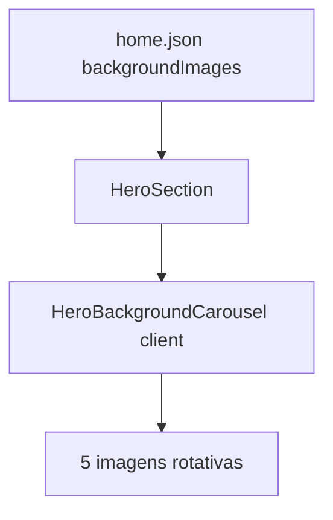

# CorpusCriste v0.0.5 — Home, rodapé e melhorias

## Escopo

Não é nova página de conteúdo mariano/ministério — é **release de revisão UX + código** sobre a Home e o layout global. Bump [`specs/version.json`](specs/version.json) para `0.0.4` → `0.0.5` e criar [`specs/spec-0.0.5.md`](specs/spec-0.0.5.md).

---

## 1. Rodapé global

Arquivo: [`components/layout/Footer.tsx`](components/layout/Footer.tsx) (textos hoje hardcoded).

| Atual | Novo |
|-------|------|
| Linha `Ministério DEA Ajuda` | `Ministério DEA Programadores` (easter egg) |
| `Evangelização • Ações Sociais • Casas de Acolhida • Caridade` | `Evangelização • Amizade • Compromisso • Serviço` |
| `© 2026 Ministério DEA Ajuda. Todos os direitos reservados.` | `© 2026 Grupo Deus É Amor. Todos os direitos reservados.` |

Manter logo e título principal **Grupo Deus É Amor** como estão.

Também atualizar copyright em [`README.md`](README.md) (linha final) se ainda citar DEA Ajuda.

**Testes:** ajustar [`specs/tests/e2e/home-visual.spec.ts`](specs/tests/e2e/home-visual.spec.ts) para validar copyright com "Grupo Deus É Amor"; opcionalmente assert da linha easter egg e dos novos pilares.

---

## 2. Home — conteúdo ([`specs/content/home.json`](specs/content/home.json))

### Hero

| Campo | Valor |
|-------|-------|
| `title` | `Grupo Deus É Amor` |
| `subtitle` | `Jovens evangelizando Jovens desde 2000` |
| `quote` | `Aquele que não ama não conhece a Deus, porque Deus é amor.` (1 João 4:8) |
| `backgroundImages` | array com 5 paths locais (ver assets abaixo) |
| `backgroundImage` | primeiro item do array (fallback para páginas que só leem um campo) |

Remover URL Unsplash atual.

### Seção 1 — Grupo (manter foco no grupo, sem ministério)

- Título: `Grupo Deus É Amor` (ou equivalente)
- Texto sobre missão, oração, fraternidade
- **Alinhar horário** com o convite: quintas-feiras **19h30** (hoje o JSON diz 19h15)

### Seção 2 — substituir bloco DEA Ajuda

Remover totalmente título e parágrafos que citam **DEA Ajuda** ou qualquer ministério.

Novo bloco (ex.: título `Venha participar`):

- Convite a quem ainda não conhece o grupo
- Reuniões: **todas as quintas-feiras, 19h30**, no **Auditório Dona Guilhermina**, ao lado do **Centro Catequético da Catedral de Maringá**
- `cta` primário: Instagram (mesmo label/href atuais)
- `secondaryCta` (novo campo JSON): label tipo `Títulos de Nossa Senhora`, href `/titulos-nossa-senhora`

### Meta

- `meta.title` / `description`: refletir Grupo DEA, não Auxiliadora como foco principal

---

## 3. Assets — carrossel do hero

Copiar os 5 PNG anexados para `public/images/`:

| Asset anexo | Destino sugerido |
|-------------|------------------|
| `image-e8d9ffc2-...png` | `home-carousel-01.png` (foto geral do auditório) |
| `image-5dc51892-...png` | `home-carousel-02.png` (mãos levantadas) |
| `image-3e1f6512-...png` | `home-carousel-03.png` (oração ajoelhados) |
| `image-652dd648-...png` | `home-carousel-04.png` (corrente de mãos) |
| `image-cf821a9f-...png` | `home-carousel-05.png` (palco / adoração) |

Referenciar no `home.json` como `/images/home-carousel-0N.png`.

---

## 4. Código — fundo dinâmico do hero

Hoje [`HeroSection.tsx`](components/content/HeroSection.tsx) usa um único `backgroundImage` em CSS.

**Abordagem:**

1. Estender [`heroSchema`](lib/specs/types.ts) com campo opcional `backgroundImages: z.array(z.string()).min(1).optional()`
2. Criar componente cliente `HeroBackgroundCarousel` (ex.: [`components/content/HeroBackgroundCarousel.tsx`](components/content/HeroBackgroundCarousel.tsx)):
   - Crossfade entre imagens a cada ~5–6s
   - `prefers-reduced-motion`: exibir apenas a primeira imagem
   - Overlay do JSON aplicado por cima (mesmo gradiente atual)
3. `HeroSection` renderiza o carrossel quando `backgroundImages?.length > 1`; caso contrário, comportamento atual

Isso limita o carrossel à Home sem alterar páginas marianas/ministérios.



---

## 5. Código — CTA secundário configurável

Problema atual: em [`SectionRenderer.tsx`](components/content/SectionRenderer.tsx) linhas 45–50, o botão secundário está **fixo** em `Conheça o DEA Ajuda` → `/ministerios/dea-ajuda` sempre que existe `cta` Instagram.

**Melhoria:**

- Estender `paragraphSectionSchema` em [`lib/specs/types.ts`](lib/specs/types.ts):

```typescript
secondaryCta: z.object({ label: z.string(), href: z.string() }).optional()
```

- Renderizar botão secundário **somente** se `secondaryCta` existir (remover hardcode DEA Ajuda)
- Home: `secondaryCta` → Títulos de Nossa Senhora

Outras páginas não são afetadas.

---

## 6. Documentação e testes

| Arquivo | Alteração |
|---------|-----------|
| `specs/spec-0.0.5.md` | resumo: rodapé, home, carrossel, CTA JSON |
| `specs/version.json` | `0.0.5` |
| `specs/tests/checklist.json` | versão + item `home-grupo-vitrine` (sem ministério; hero Grupo DEA; convite quintas) + atualizar `footer-copyright` / `home-content` |
| `.cursor/rules/corpus-criste-pages.mdc` | nota: Home com carrossel e sem menção a ministérios |
| `README.md` | copyright + nota v0.0.5 |

**Validação:**

- `npm run test:specs`
- `npm run build`
- `CI=1 npm run test:e2e` (liberar porta 3000 se `npm run start` estiver ativo)

---

## 7. Melhorias de código (escopo contido)

- Eliminar acoplamento Home → DEA Ajuda no `SectionRenderer`
- Tipagem explícita do hero com carrossel (schema Zod)
- `data-testid` opcional no carrossel / copyright para e2e estáveis
- **Fora do escopo:** refatorar DEA Ajuda, navbar, outras páginas de conteúdo, novo ministério "DEA Programadores"

---

## Fora do escopo

- Páginas de ministérios ou títulos marianos (exceto link na Home)
- Redirects ou nova rota
- Imagens inline em cards
- Criar página real para "Ministério DEA Programadores"
