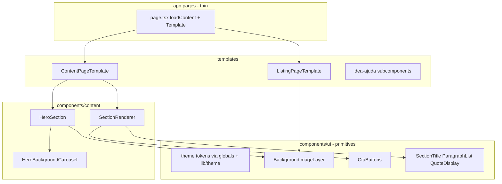

# CorpusCriste v0.1.0 — Revisão técnica (sem mudança visual)

## Objetivo

Refatoração **interna** do código: componentização, DRY, performance e documentação. **Critério de aceite:** `npm run test:specs`, `npm run build` e `CI=1 npm run test:e2e` passam; mesmos `data-testid`, mesmas classes visuais efetivas (ou equivalentes via tokens).

Não é release de conteúdo (`0.0.x` páginas). Bump [`specs/version.json`](specs/version.json) → `0.1.0`, `specFile: spec-0.1.0.md`.

---

## Diagnóstico (estado atual)

| Área | Problema | Impacto |
|------|----------|---------|
| Cores/sombras | `#d4af37`, `rgba(212,175,55,…)`, `#0f0f12` repetidos em 10+ arquivos | Manutenção, risco de drift visual |
| [`SectionRenderer.tsx`](components/content/SectionRenderer.tsx) | `ParagraphSectionView` e `CardSectionView` duplicam título, parágrafos e estilos de quote | DRY |
| CTAs | Gradiente Instagram e botão outline inline em `style`/`className` longos | Legibilidade |
| [`ListingPageTemplate.tsx`](components/content/ListingPageTemplate.tsx) | Card de listagem como JSX anônimo (~50 linhas) | Reuso |
| [`HeroBackgroundCarousel.tsx`](components/content/HeroBackgroundCarousel.tsx) | `setInterval` + re-render a cada 5,5s | Performance (main thread) |
| [`HeroSection`](components/content/HeroSection.tsx) / [`ListingPageTemplate`](components/content/ListingPageTemplate.tsx) | `backgroundImage` inline | Padrão inconsistente |
| [`dea-ajuda/page.tsx`](app/ministerios/dea-ajuda/page.tsx) | ~180 linhas, seções monolíticas, 2× `style={{ backgroundImage }}` | Exceção válida, mas pode subcomponentizar **sem** mudar layout |
| [`lib/utils.ts`](lib/utils.ts) `cn()` | Usado só em [`select.tsx`](components/ui/select.tsx) não referenciado no app | Código morto |
| [`app/layout.tsx`](app/layout.tsx) | `metadata` default ainda cita Auxiliadora | SEO fallback desatualizado (não afeta Home com metadata própria) |

**Fora do escopo (regra existente):** converter DEA Ajuda para `ContentPageTemplate`; alterar JSON de conteúdo; mudar navbar/rotas.

---

## Arquitetura alvo

---

## 1. Tokens e utilitários (`lib/theme.ts` + CSS)

Criar [`lib/theme.ts`](lib/theme.ts) com constantes exportadas (overlay padrão, sombras) e helpers `cn()` para classes compostas:

- `goldText`, `goldBorder`, `surfaceCard`, `heroOverlayDefault`, `contentContainer`, `instagramButtonClass`
- Migrar valores **idênticos** aos atuais — não “melhorar” visual

Em [`app/globals.css`](app/globals.css), opcionalmente adicionar utilitários `@layer components` (ex.: `.shadow-card`, `.border-gold-subtle`) espelhando inline styles atuais de [`ContentCard.tsx`](components/content/ContentCard.tsx).

**Usar `cn()`** em todos os componentes refatorados.

---

## 2. Primitivos UI (`components/ui/`)

| Componente | Extrai de | Responsabilidade |
|------------|-----------|------------------|
| `BackgroundImageLayer` | Hero, Listing, DEA Ajuda | `absolute inset-0` + cover/center + URL; variantes `cover` / `contain` / opacity |
| `GradientOverlay` | Carousel, heroes | `background` do overlay JSON |
| `SectionTitle` | SectionRenderer | `h2` serif dourado |
| `ParagraphList` | SectionRenderer | map `paragraphs` com `key` estável |
| `QuoteDisplay` | SectionRenderer | variantes `centered` (paragraphs) e `border-left` (card) |
| `InstagramCtaButton` | SectionRenderer | gradiente Instagram (sem `style` inline) via classe em globals |
| `OutlineGoldLink` | SectionRenderer, secondary Cta | `Link` com borda dourada |
| `CtaButtonGroup` | SectionRenderer | flex row/col dos CTAs |
| `HeroLogo` | HeroSection | `Image` + sombra dourada |
| `ListingCard` | ListingPageTemplate | card link/disabled com emoji, título, descrição |

Manter `data-testid` existentes nos mesmos nós (ou no wrapper equivalente).

---

## 3. Refatorar `SectionRenderer`

- `CardSectionBody`: título + parágrafos + quote opcional (prop `quoteVariant`)
- `ParagraphSectionView` / `CardSectionView` ficam finos (~15 linhas cada)
- CTAs delegam a `CtaButtonGroup` + botões UI

Comportamento e HTML semântico equivalente ao atual.

---

## 4. Hero e carrossel (performance)

[`HeroSection.tsx`](components/content/HeroSection.tsx):

- Usar `BackgroundImageLayer` + `GradientOverlay` no modo single-image
- Extrair `HeroLogo`, container `relative z-10`

[`HeroBackgroundCarousel.tsx`](components/content/HeroBackgroundCarousel.tsx) — otimizar **sem mudar timing visual**:

- Preferir **crossfade CSS** (`@keyframes` + `animation-delay` por slide) em vez de `setInterval` + `useState`, reduzindo re-renders
- Manter `prefers-reduced-motion`: só primeira imagem
- `next/image`: `priority` na primeira; demais sem priority
- Client component permanece **apenas** no carrossel; `HeroSection` pode continuar Server Component importando o client child (boundary mínimo)

---

## 5. Templates e layout

- [`ListingPageTemplate.tsx`](components/content/ListingPageTemplate.tsx): hero via `BackgroundImageLayer`; grid com `ListingCard`
- [`ContentPageTemplate.tsx`](components/content/ContentPageTemplate.tsx): sem mudança estrutural (já enxuto)
- [`Navbar.tsx`](components/layout/Navbar.tsx) + [`NavDropdown.tsx`](components/layout/NavDropdown.tsx): extrair `getNavLinkClasses(isActive)` em [`lib/theme.ts`](lib/theme.ts) ou `lib/nav-styles.ts`; opcional `MobileNavSection` para reduzir duplicação mobile/desktop (mesmas classes)

[`Footer.tsx`](components/layout/Footer.tsx): apenas migrar para tokens/`cn` se aplicável (textos inalterados).

---

## 6. DEA Ajuda (exceção — subcomponentes locais)

Criar pasta [`components/dea-ajuda/`](components/dea-ajuda/):

- `DeaAjudaHero`, `DeaAjudaAbout`, `DeaAjudaVideo`, `DeaAjudaProjects`, `DeaAjudaInspiration`, `DeaAjudaValues`, `DeaAjudaQuote`

[`app/ministerios/dea-ajuda/page.tsx`](app/ministerios/dea-ajuda/page.tsx) vira orquestrador (~30 linhas). Reutilizar `BackgroundImageLayer` onde hoje há `style={{ backgroundImage }}`.

**Não** alterar classes Tailwind nem estrutura visual das seções.

---

## 7. Limpeza e metadata

- Remover ou documentar [`components/ui/select.tsx`](components/ui/select.tsx) se confirmado não usado (grep zero imports)
- Atualizar `metadata` default em [`app/layout.tsx`](app/layout.tsx) para alinhar com Home v0.0.5 (Grupo DEA) — fallback SEO apenas

---

## 8. Documentação para agentes futuros

Criar **[`specs/CORPUS-CRISTE-ENGINEERING.md`](specs/CORPUS-CRISTE-ENGINEERING.md)** (contexto principal para agentes):

**Seções:**

1. **Princípio:** conteúdo em JSON; UI em componentes; `page.tsx` fino
2. **Hierarquia:** `ui` → `content`/`layout` → `templates` → `app`
3. **Server vs Client:** só `'use client'` para interatividade (nav mobile, carrossel); resto Server
4. **O que NÃO fazer:** JSX de hero/card em `page.tsx`; hardcode DEA Ajuda em componentes genéricos; novos hex sem `lib/theme`; converter DEA Ajuda para template genérico
5. **O que fazer:** novos CTAs via schema + `CtaButtonGroup`; backgrounds via `BackgroundImageLayer`; testids preservados
6. **DEA Ajuda:** única página custom; estender só `components/dea-ajuda/`
7. **Performance:** carrossel CSS; `priority` só primeira imagem; evitar state polling
8. **Testes obrigatórios** antes de merge

Referenciar em [`.cursor/rules/corpus-criste-base.mdc`](.cursor/rules/corpus-criste-base.mdc) (1 parágrafo + link).

Criar [`specs/spec-0.1.0.md`](specs/spec-0.1.0.md) com checklist da refatoração e “zero regressão visual”.

Atualizar [`specs/tests/checklist.json`](specs/tests/checklist.json): `version: 0.1.0` + item `engineering-patterns` (componentes UI, sem inline styles desnecessários).

---

## 9. Validação

| Comando | Esperado |
|---------|----------|
| `npm run test:specs` | JSON inalterado (salvo se metadata root for considerado fora de specs) |
| `npm run build` | 15 rotas estáticas |
| `CI=1 npm run test:e2e` | 34 testes; mesmos testids |

Revisão manual rápida: Home carrossel, uma página mariana compact, listagem, DEA Ajuda, rodapé easter egg.

---

## Ordem de implementação sugerida

1. `lib/theme.ts` + globals utilities
2. Primitivos UI (`BackgroundImageLayer`, botões, tipografia)
3. `SectionRenderer` + `ListingPageTemplate` + `HeroSection`/`HeroBackgroundCarousel`
4. Navbar styles helper
5. DEA Ajuda subcomponentes
6. Docs (`CORPUS-CRISTE-ENGINEERING.md`, `spec-0.1.0.md`, rules, version bump)
7. Testes e build

---

## Fora do escopo v0.1.0

- Novas páginas ou alteração de textos JSON
- i18n, dark mode toggle, Storybook
- Refatorar `lib/specs/types.ts` / loader
- Mudar política `0.0.x` = uma página (permanece em versions.mdc)
