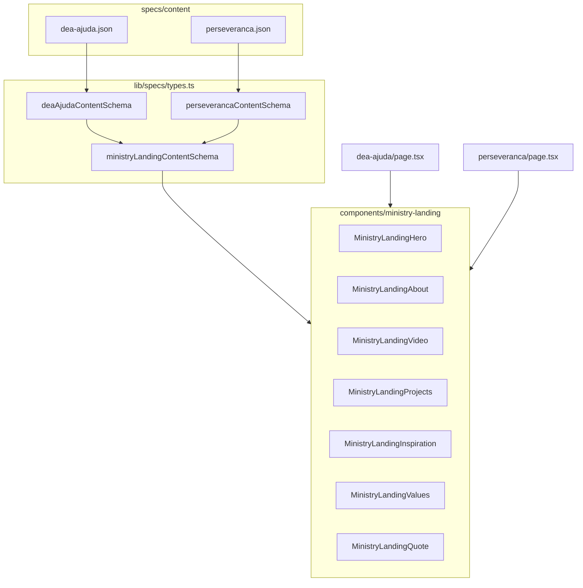

# v0.1.1 — Perseverança no padrão DEA Ajuda

## Objetivo

Substituir o [`ContentPageTemplate` compact](app/ministerios/perseveranca/page.tsx) por um **layout custom de ministério** com as mesmas 7 seções da [DEA Ajuda](app/ministerios/dea-ajuda/page.tsx): Hero → About → Video → Projects → Inspiration → Values → Quote.

O conteúdo continua sendo o do ministério Perseverança (textos atuais em [`specs/content/perseveranca.json`](specs/content/perseveranca.json)), apenas reorganizado — não copiar textos da DEA Ajuda.

## Arquitetura



**Decisão:** generalizar `components/dea-ajuda/*` → `components/ministry-landing/*` em vez de duplicar 7 componentes só para Perseverança. A DEA Ajuda passa a importar os mesmos componentes (comportamento visual preservado).

## 1. Schema compartilhado (`lib/specs/types.ts`)

Extrair de `deaAjudaContentSchema` um bloco reutilizável, por exemplo `ministryLandingFields`:

| Seção | Campos (igual DEA Ajuda) |
|-------|---------------------------|
| `hero` | `title`, `highlight`, `subtitle`, `tagline`, `backgroundImage`, `ctaLabel`, `ctaHref`, **`badge`** (novo) |
| `about` | `title`, `paragraphs[]`, `highlight?` |
| `video` | `title`, `titleHighlight`, `description`, `placeholder` |
| `projects` | `title`, `titleHighlight`, `description`, `items[]` (emoji, title, description) |
| `inspiration` | `title`, `titleHighlight`, `backgroundImage`, `paragraphs[]` |
| `values` | `title`, `titleHighlight`, `items[]` (icon, title, description) |
| `quote` | `text`, `author` |

**`hero.badge`** (discriminated union) — hoje `DeaAjudaHero` fixa o texto `"DEA"` no círculo:

```tsx
// DeaAjudaHero.tsx — hardcoded
<span className="text-primary text-4xl font-bold">DEA</span>
```

- `type: 'text', label: string` → DEA Ajuda (`"DEA"`)
- `type: 'image', src, alt, width?, height?` → Perseverança (`/logo-deus-e-amor.png`, como no JSON atual)

Schemas finais:

- `deaAjudaContentSchema` = `ministryLandingFields` + `slug: 'dea-ajuda'`
- `perseverancaContentSchema` = **substituir** `contentPageSchema.extend(...)` por `ministryLandingFields` + `slug: 'perseveranca'`

Exportar tipo `MinistryLandingContent` para props dos componentes.

## 2. Componentes (`components/ministry-landing/`)

Renomear e tipar com `MinistryLandingContent` (não `DeaAjudaContent`):

| Atual | Novo |
|-------|------|
| `DeaAjudaHero` | `MinistryLandingHero` (+ renderizar `badge` text/image) |
| `DeaAjudaAbout` | `MinistryLandingAbout` |
| `DeaAjudaVideo` | `MinistryLandingVideo` |
| `DeaAjudaProjects` | `MinistryLandingProjects` |
| `DeaAjudaInspiration` | `MinistryLandingInspiration` |
| `DeaAjudaValues` | `MinistryLandingValues` |
| `DeaAjudaQuote` | `MinistryLandingQuote` |

- Remover pasta [`components/dea-ajuda/`](components/dea-ajuda/) após migração.
- Manter classes Tailwind/shadcn (`bg-primary`, `BackgroundImageLayer`, etc.) — **sem alterar o visual da DEA Ajuda**.
- Preservar `data-testid` existentes, se houver; não remover sem equivalente.

## 3. Conteúdo Perseverança ([`specs/content/perseveranca.json`](specs/content/perseveranca.json))

Reescrever no formato de 7 seções, mapeando os 4 cards atuais:

| Seção | Origem do texto atual |
|-------|------------------------|
| **hero** | Título/subtítulo/citação do hero; `backgroundImage`: `/images/ministerio-perseveranca.png`; `highlight`: `"Ministério"`, `title`: `"Perseverança"`; CTA `#video`; `badge` image logo |
| **about** | Card *"O Ministério Perseverança"* + frase do objetivo como `highlight` |
| **video** | Nova seção estrutural (como DEA): títulos sobre formação/jornada; `placeholder`: `"Vídeo em breve"` |
| **projects** | 4 eixos derivados de *"Caminho do servir"* e formação (ex.: Formação e oração, Comunidade fraterna, Serviço na comunidade, Perseverança na vocação) — cada um com emoji + parágrafo curto |
| **inspiration** | Card *"Nosso grupo de servos"*; `backgroundImage`: mesma foto do grupo |
| **values** | 4 valores alinhados ao ministério: Gentileza, Generosidade, Perseverança, Serviço (ícones `heart` / `users` / `cross` / `smile`) |
| **quote** | Card *"Chamado"* — `author`: `"Ministério Perseverança"` (ou equivalente curto) |

## 4. DEA Ajuda ([`specs/content/dea-ajuda.json`](specs/content/dea-ajuda.json))

Adicionar apenas:

```json
"badge": { "type": "text", "label": "DEA" }
```

em `hero` — sem mudar demais campos.

## 5. Páginas

**[`app/ministerios/perseveranca/page.tsx`](app/ministerios/perseveranca/page.tsx)** — espelhar o orquestrador da DEA Ajuda (~30 linhas):

```tsx
<main className="min-h-screen bg-background text-foreground">
  <MinistryLandingHero hero={hero} />
  ...
</main>
```

**[`app/ministerios/dea-ajuda/page.tsx`](app/ministerios/dea-ajuda/page.tsx)** — trocar imports para `components/ministry-landing/*`.

## 6. Loader e specs

- [`lib/specs/loader.ts`](lib/specs/loader.ts): `perseveranca` deixa de usar `perseverancaContentSchema` baseado em `contentPageSchema`; validar com novo schema.
- [`specs/version.json`](specs/version.json) → `0.1.1`, `specFile`: `spec-0.1.1.md`
- Criar [`specs/spec-0.1.1.md`](specs/spec-0.1.1.md) (escopo: Perseverança + generalização ministry-landing)
- [`specs/tests/checklist.json`](specs/tests/checklist.json): `version: 0.1.1`; atualizar item `perseveranca-content` (hero 7 seções, projetos, valores, citação — não mais “cards compact”)

## 7. Documentação e regras

Atualizar para refletir **duas** páginas com layout ministry-landing:

- [`specs/CORPUS-CRISTE-ENGINEERING.md`](specs/CORPUS-CRISTE-ENGINEERING.md) — `components/ministry-landing/`; DEA Ajuda e Perseverança orquestram o mesmo layout
- [`.cursor/rules/corpus-criste-pages.mdc`](.cursor/rules/corpus-criste-pages.mdc) — Perseverança: Custom (ministry-landing), não ContentPageTemplate
- [`.cursor/rules/corpus-criste-base.mdc`](.cursor/rules/corpus-criste-base.mdc) — remover “única exceção DEA Ajuda”; citar ministry-landing para `/ministerios/dea-ajuda` e `/ministerios/perseveranca`

## 8. Testes

| Comando | Expectativa |
|---------|-------------|
| `npm run test:specs` | JSON Perseverança + DEA Ajuda validam |
| `npm run build` | 15 rotas estáticas |
| `CI=1 npm run test:e2e` | DEA Ajuda inalterada; **novo** `specs/tests/e2e/perseveranca-visual.spec.ts` (hero “Perseverança”, um projeto, valores/citação, footer) |

## Fora de escopo

- Alterar páginas marianas ou `ContentPageTemplate`
- Vídeo real (permanece placeholder)
- Commit/git (só se o usuário pedir)

## Ordem de implementação sugerida

1. Schema + tipos + `dea-ajuda.json` (`badge`)
2. `components/ministry-landing/*` (migrar de dea-ajuda)
3. Atualizar `dea-ajuda/page.tsx`; remover `dea-ajuda/`
4. `perseveranca.json` + `perseveranca/page.tsx`
5. Docs, version, checklist, e2e
6. `test:specs` → `build` → `test:e2e`
