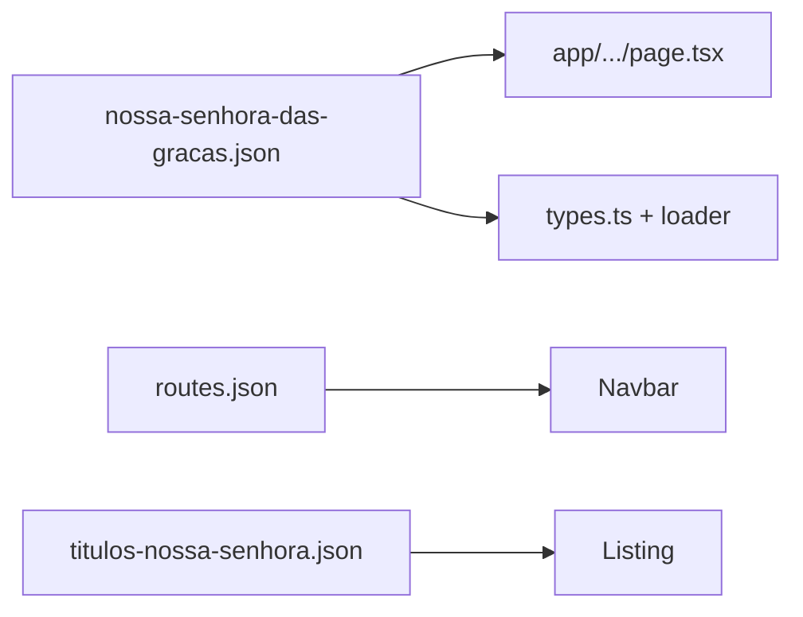

# v0.1.2 — Rodapé + Nossa Senhora das Graças

## Ordem de execução

1. **Rodapé** (antes da nova página, conforme pedido)
2. **Página das Graças** (padrão das demais devoções marianas)
3. **Versionamento e validação**

---

## 1. Rodapé — Compromisso → Humildade

Alterar uma linha em [`components/layout/Footer.tsx`](components/layout/Footer.tsx):

```tsx
Evangelização • Amizade • Humildade • Serviço
```

**Testes:** em [`specs/tests/e2e/home-visual.spec.ts`](specs/tests/e2e/home-visual.spec.ts), o assert em `footer-pillars` hoje verifica só `Amizade`. Incluir assert de `Humildade` e garantir que `Compromisso` não apareça (evita regressão).

**Docs:** atualizar menção em [`specs/spec-0.0.5.md`](specs/spec-0.0.5.md) apenas se quiser histórico alinhado (opcional); o spec ativo será `spec-0.1.2.md`.

---

## 2. Nova página — Nossa Senhora das Graças

### Padrão técnico (igual Guadalupe / Lourdes)

| Item | Valor |
|------|--------|
| Slug | `nossa-senhora-das-gracas` |
| Rota | `/titulos-nossa-senhora/nossa-senhora-das-gracas` |
| Template | `ContentPageTemplate` + prop `compact` |
| `page.tsx` | Copiar de [`app/titulos-nossa-senhora/nossa-senhora-lourdes/page.tsx`](app/titulos-nossa-senhora/nossa-senhora-lourdes/page.tsx) trocando o slug |

### Imagem de fundo (hero)

- Copiar o anexo do workspace para [`public/images/nossa-senhora-das-gracas.png`](public/images/nossa-senhora-das-gracas.png)  
  Origem: `.cursor/projects/home-michel-Dados-DEA-CorpusCriste/assets/image-3e028b8f-4951-4675-b8a2-50710cf3990d.png`
- No JSON do hero: `"backgroundImage": "/images/nossa-senhora-das-gracas.png"` + `overlay` padrão (`heroOverlayCompact` em [`lib/theme.ts`](lib/theme.ts), igual às outras páginas marianas) para legibilidade do texto sobre imagem clara

### Conteúdo — [`specs/content/nossa-senhora-das-gracas.json`](specs/content/nossa-senhora-das-gracas.json)

Texto fornecido pelo Grupo, organizado em **cards** (revisão editorial leve: pontuação, maiúsculas em nomes próprios, sem alterar fatos):

| Card | `variant` | Conteúdo |
|------|-----------|----------|
| **A devoção e as três aparições** | `highlight` | Intro: 1830, Catarina Labouré, Filhas da Caridade, três aparições no convento em Paris |
| **Primeira aparição** | — | 18 para 19 de julho de 1830; revelação sobre perseguições na França |
| **Segunda aparição** | `highlight` | 27 de novembro de 1830; visão sobre o globo, serpente, raios de luz; frase da medalha; reverso com M, cruz e corações |
| **A Medalha Milagrosa** | — | Pedido de cunhar a medalha; espalhamento e graças extraordinárias |
| **Terceira aparição** | — | Final de dezembro de 1830; junto ao sacrário; reforço para distribuir a medalha |
| **Dogma e festa** | — | 1854 — Pio IX e Imaculada Conceição; festa em 27 de novembro em várias partes do mundo |

**Hero sugerido:**

- `title`: "Nossa Senhora das Graças"
- `subtitle`: "1830 — Paris, Filhas da Caridade"
- `quote`: "Ó Maria concebida sem pecado, rogai por nós que recorremos a vós."
- `logo`: mesmo bloco das outras páginas marianas (`/logo-deus-e-amor.png`)

**Meta:** título e description SEO alinhados ao tema (devoção, Medalha Milagrosa, Santa Catarina Labouré).

### Registros obrigatórios



- [`lib/specs/types.ts`](lib/specs/types.ts): `nossaSenhoraDasGracasContentSchema` + `ContentSlug` + `contentSchemas`
- [`lib/specs/loader.ts`](lib/specs/loader.ts): `case` + `validateAllSpecs()`
- [`specs/routes.json`](specs/routes.json): item com `parent: "/titulos-nossa-senhora"` e label **Nossa Senhora das Graças**
- [`specs/content/titulos-nossa-senhora.json`](specs/content/titulos-nossa-senhora.json): novo card na galeria (antes do item `template`), emoji sugerido: medalha/devoção (ex. símbolo neutro já usado no projeto)

**Navbar / e2e:** [`specs/tests/e2e/navigation.spec.ts`](specs/tests/e2e/navigation.spec.ts) lê `routes.json` dinamicamente — nova rota entra nos testes de dropdown/mobile automaticamente (+1 teste por fluxo).

---

## 3. Versionamento 0.1.2

| Arquivo | Ação |
|---------|------|
| [`specs/version.json`](specs/version.json) | `contentVersion: "0.1.2"`, `specFile: "spec-0.1.2.md"` |
| [`specs/spec-0.1.2.md`](specs/spec-0.1.2.md) | Resumo: rodapé + nova rota + imagem |
| [`specs/tests/checklist.json`](specs/tests/checklist.json) | `version: 0.1.2` + item `nossa-senhora-das-gracas-content` |
| [`.cursor/rules/corpus-criste-pages.mdc`](.cursor/rules/corpus-criste-pages.mdc) | Linha na tabela de templates |
| [`.cursor/rules/corpus-criste-versions.mdc`](.cursor/rules/corpus-criste-versions.mdc) | Linha 0.1.2 no histórico |
| [`README.md`](README.md) | Rota na tabela de páginas (se existir lista) |

---

## 4. Validação

| Comando | Expectativa |
|---------|-------------|
| `npm run test:specs` | Novo JSON valida |
| `npm run build` | **16** rotas estáticas (+1) |
| `CI=1 npm run test:e2e` | Navbar inclui Graças; footer com Humildade |

---

## Fora de escopo

- Alterar outras páginas marianas ou ministérios
- Commit/git (só se o usuário pedir)
- Editar arquivos em `.cursor/plans/`
