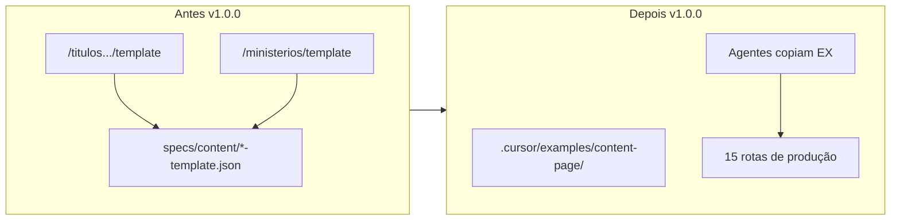

# Release 1.0.0 — site sem modelos + exemplo para agentes

## Contexto

Hoje existem **duas rotas públicas de referência** que não são conteúdo editorial:

- `/titulos-nossa-senhora/template` → [`app/titulos-nossa-senhora/template/page.tsx`](app/titulos-nossa-senhora/template/page.tsx) + [`specs/content/titulos-nossa-senhora-template.json`](specs/content/titulos-nossa-senhora-template.json)
- `/ministerios/template` → [`app/ministerios/template/page.tsx`](app/ministerios/template/page.tsx) + [`specs/content/ministerios-template.json`](specs/content/ministerios-template.json)

Elas aparecem na navbar ([`specs/routes.json`](specs/routes.json)), nas listagens ([`specs/content/titulos-nossa-senhora.json`](specs/content/titulos-nossa-senhora.json), [`specs/content/ministerios.json`](specs/content/ministerios.json)) e no loader Zod ([`lib/specs/types.ts`](lib/specs/types.ts), [`lib/specs/loader.ts`](lib/specs/loader.ts)).

O [`package.json`](package.json) já está em `1.0.0`; o conteúdo em [`specs/version.json`](specs/version.json) ainda está em `0.1.6` — este release alinha **contentVersion** e documentação.



## Rotas finais (produção — 15 páginas)

| Rota | Tipo |
|------|------|
| `/` | Home (`ContentPageTemplate`) |
| `/titulos-nossa-senhora` | Listagem |
| `/titulos-nossa-senhora/nossa-senhora-auxiliadora` | Conteúdo compact |
| `/titulos-nossa-senhora/nossa-senhora-medjugorje` | Conteúdo compact |
| `/titulos-nossa-senhora/nossa-senhora-aparecida` | Conteúdo compact |
| `/titulos-nossa-senhora/nossa-senhora-la-salette` | Conteúdo compact |
| `/titulos-nossa-senhora/nossa-senhora-lourdes` | Conteúdo compact |
| `/titulos-nossa-senhora/nossa-senhora-guadalupe` | Conteúdo compact |
| `/titulos-nossa-senhora/nossa-senhora-das-gracas` | Conteúdo compact |
| `/titulos-nossa-senhora/nossa-senhora-da-comunicacao` | Conteúdo compact |
| `/titulos-nossa-senhora/nossa-senhora-das-dores` | Conteúdo compact |
| `/titulos-nossa-senhora/nossa-senhora-de-fatima` | Conteúdo compact |
| `/ministerios` | Listagem |
| `/ministerios/dea-ajuda` | Ministry landing (exceção) |
| `/ministerios/perseveranca` | Ministry landing (exceção) |

**Redirects** (sem mudança): [`vercel.json`](vercel.json) — `/imagens`, `/dea-ajuda`, `/nossa-senhora-auxiliadora`.

**Fora do escopo:** redirects de `/titulos-nossa-senhora/template` e `/ministerios/template` (404 aceitável; eram páginas internas de referência).

---

## 1. Exemplo único em `.cursor` (substitui os dois modelos)

Criar pasta **[`.cursor/examples/content-page/`](.cursor/examples/content-page/)** com:

| Arquivo | Conteúdo |
|---------|----------|
| `README.md` | Checklist para agentes: copiar JSON + `page.tsx`, registrar slug, `routes.json`, card na listagem, `npm run test:specs` / `build` / `e2e`; referência real: [`nossa-senhora-de-fatima`](specs/content/nossa-senhora-de-fatima.json); exceção ministry-landing para DEA Ajuda / Perseverança |
| `content.example.json` | Baseado no atual `titulos-nossa-senhora-template.json`, com `slug` placeholder (`your-slug`), textos genéricos (sem “Modelo” como título público) e comentários mínimos só no README (JSON válido) |
| `page.example.tsx` | Cópia do padrão mínimo (como [`app/titulos-nossa-senhora/nossa-senhora-de-fatima/page.tsx`](app/titulos-nossa-senhora/nossa-senhora-de-fatima/page.tsx)) com `your-slug` |

**Não** manter dois exemplos (títulos + ministérios): os JSONs eram quase idênticos; o README cobre listagem vs conteúdo e a exceção `ministry-landing`.

---

## 2. Remover modelos do site

**Apagar:**

- [`app/titulos-nossa-senhora/template/`](app/titulos-nossa-senhora/template/)
- [`app/ministerios/template/`](app/ministerios/template/)
- [`specs/content/titulos-nossa-senhora-template.json`](specs/content/titulos-nossa-senhora-template.json)
- [`specs/content/ministerios-template.json`](specs/content/ministerios-template.json)

**Editar:**

- [`specs/routes.json`](specs/routes.json) — remover entradas “Modelo (Títulos…)” e “Modelo (Ministérios)”
- [`specs/content/titulos-nossa-senhora.json`](specs/content/titulos-nossa-senhora.json) — remover card `slug: "template"`
- [`specs/content/ministerios.json`](specs/content/ministerios.json) — remover card `slug: "template"`
- [`lib/specs/types.ts`](lib/specs/types.ts) — remover `titulosNossaSenhoraTemplateContentSchema`, `ministeriosTemplateContentSchema`, literais e entradas no union/map
- [`lib/specs/loader.ts`](lib/specs/loader.ts) — remover cases, tipos em `ContentMap` e slugs em `validateAllSpecs()`

**E2E:** [`specs/tests/e2e/navigation.spec.ts`](specs/tests/e2e/navigation.spec.ts) lê `routes.json` dinamicamente — **−4 testes** (2 dropdown + 2 mobile) automaticamente; sem alteração manual no spec.

---

## 3. Atualizar regras Cursor

| Arquivo | Mudança |
|---------|---------|
| [`.cursor/rules/corpus-criste-base.mdc`](.cursor/rules/corpus-criste-base.mdc) | “Copy from `.cursor/examples/content-page/`” em vez de rotas `/template` |
| [`.cursor/rules/corpus-criste-pages.mdc`](.cursor/rules/corpus-criste-pages.mdc) | Remover linhas **Títulos template** / **Ministérios template** da tabela; checklist aponta para `.cursor/examples/content-page/` |
| [`.cursor/rules/corpus-criste-versions.mdc`](.cursor/rules/corpus-criste-versions.mdc) | Linha `1.0.0` no histórico; passo 2 do checklist → copiar de `.cursor/examples/content-page/page.example.tsx`; nota de que modelos públicos foram retirados |

Histórico em `specs/spec-0.0.0.md` permanece como documentação do baseline — não reescrever.

---

## 4. Release notes e checklist

- Criar **[`specs/spec-1.0.0.md`](specs/spec-1.0.0.md)** — marco: conjunto mariano completo (até Fátima), ministérios em production layout, remoção de páginas-modelo públicas, exemplo agent-only em `.cursor`
- Atualizar [`specs/version.json`](specs/version.json): `contentVersion: "1.0.0"`, `specFile: "spec-1.0.0.md"`, `releasedAt` atual
- Atualizar [`specs/tests/checklist.json`](specs/tests/checklist.json):
  - `version`: `1.0.0`
  - `nav-dropdown-children`: remover “incluindo modelos”
  - Remover ou substituir item `template-pages` por algo como “exemplo em `.cursor/examples/content-page/` existe para novas páginas”
  - `approved-model`: copiar de `.cursor/examples/content-page/`, não de rotas `/template`

---

## 5. README completo

Reescrever seções principais de [`README.md`](README.md):

1. **Rotas** — tabela acima (15 rotas), sem linhas de template; manter nota de navbar e redirects
2. **Modelo para novas páginas** — apontar para `.cursor/examples/content-page/` + link para `corpus-criste-pages.mdc` e `CORPUS-CRISTE-ENGINEERING.md`
3. **Versionamento** — tabela até `1.0.0` (incluir `0.1.1`–`0.1.6` que faltam hoje); entrada `1.0.0` = remoção de modelos públicos + README alinhado
4. **Estrutura de specs** — `specFile` atual = `spec-1.0.0.md`
5. **Regras Cursor** — mencionar `corpus-criste-carousels.mdc` (já existe, README ainda não lista)

---

## 6. Validação

```bash
npm run test:specs
npm run build    # esperado: 15 rotas estáticas (era ~17 com templates)
CI=1 npm run test:e2e
```

---

## Arquivos tocados (resumo)

| Ação | Arquivos |
|------|----------|
| Criar | `.cursor/examples/content-page/*`, `specs/spec-1.0.0.md` |
| Apagar | `app/**/template/`, `specs/content/*-template.json` |
| Editar | `routes.json`, listagens JSON, `types.ts`, `loader.ts`, 3× `.cursor/rules/*.mdc`, `checklist.json`, `version.json`, `README.md` |

Não alterar planos antigos em `.cursor/plans/` (histórico).
