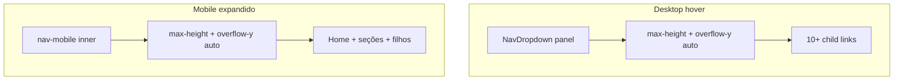

# Release 1.0.1 — scroll invisível no menu

## Problema

Com **10 títulos marianos** + ministérios, os painéis de navegação não limitam altura nem permitem rolagem:

- **Desktop:** [`NavDropdown.tsx`](components/layout/NavDropdown.tsx) — o painel filho (linha 42) cresce sem `max-height` / `overflow`
- **Mobile:** [`Navbar.tsx`](components/layout/Navbar.tsx) — o bloco interno do menu (linha 66) lista todos os links sem limite de altura

Em telas baixas ou com zoom, itens inferiores ficam inacessíveis.

## Solução

### 1. Classe reutilizável em CSS global

Em [`app/globals.css`](app/globals.css), dentro de `@layer components`, adicionar `.nav-scroll-invisible`:

- `overflow-y: auto`
- `overscroll-behavior: contain` (evita “arrastar” a página por trás)
- Barra oculta: `scrollbar-width: none` (Firefox), `-ms-overflow-style: none`, `::-webkit-scrollbar { display: none }`

Padrão alinhado ao projeto (utilitários de UI em `globals.css`, como o carrossel do hero).

### 2. Desktop — dropdown

Em [`components/layout/NavDropdown.tsx`](components/layout/NavDropdown.tsx), no `div` interno do painel (atual `min-w-[220px] rounded-xl ... py-2`):

- Classes: `nav-scroll-invisible max-h-[min(70vh,calc(100dvh-5rem))]`
- `data-testid="nav-dropdown-scroll"` no elemento rolável (facilita e2e futuro)

O wrapper externo (`absolute ... pt-2`) permanece sem scroll; só a lista de links rola.

### 3. Mobile — menu expandido

Em [`Navbar.tsx`](components/layout/Navbar.tsx), no `div` com `py-4 space-y-2` (linha 66):

- Classes: `nav-scroll-invisible max-h-[calc(100dvh-4.5rem)]`
- `data-testid="nav-mobile-scroll"`

O `header` fixo (~altura do topo + botão Menu) fica fora da área rolável.

### 4. Release 1.0.1 (documentação)

| Arquivo | Alteração |
|---------|-----------|
| [`specs/spec-1.0.1.md`](specs/spec-1.0.1.md) | Novo — correção UX do menu |
| [`specs/version.json`](specs/version.json) | `contentVersion: "1.0.1"`, `specFile: "spec-1.0.1.md"`, `releasedAt` |
| [`specs/tests/checklist.json`](specs/tests/checklist.json) | `version: "1.0.1"`; item `nav-scroll-overflow` (dropdown e mobile com scroll quando necessário) |
| [`.cursor/rules/corpus-criste-versions.mdc`](.cursor/rules/corpus-criste-versions.mdc) | Linha `1.0.1` no histórico |
| [`README.md`](README.md) | Versão atual `1.0.1`; linha na tabela de versionamento |

**Fora do escopo:** nova rota, alteração em `routes.json`, `package.json` (já em `1.0.0`).

### 5. Testes

- `npm run test:specs` — checklist version bump
- `npm run build`
- `CI=1 npm run test:e2e` — suite de navegação existente deve continuar passando (comportamento de links inalterado)

Teste e2e opcional (só se quiser reforço): em viewport baixa, verificar que `nav-dropdown-scroll` / `nav-mobile-scroll` existem e têm `overflow-y: auto` via `evaluate`. Não é obrigatório para fechar o release; o checklist documenta o critério.

## Arquivos tocados

- Criar: `specs/spec-1.0.1.md`
- Editar: `app/globals.css`, `NavDropdown.tsx`, `Navbar.tsx`, `version.json`, `checklist.json`, `corpus-criste-versions.mdc`, `README.md`
