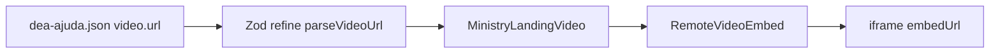

# Release 1.1.0 — reprodutor de vídeo por URL

## Objetivo

Substituir o placeholder em [`components/ministry-landing/MinistryLandingVideo.tsx`](components/ministry-landing/MinistryLandingVideo.tsx) por um embed real, **sem bibliotecas de player** (apenas `iframe` + parser de URL). O componente padrão recebe **somente `url`**; suporta os formatos dos exemplos:

| Provedor | Exemplo (registrar na regra) | Embed gerado |
|----------|------------------------------|--------------|
| YouTube | `https://youtu.be/WMXu-1avNvQ?si=r0ac31REH-ELsOH6` | `https://www.youtube.com/embed/WMXu-1avNvQ` |
| Google Drive | `https://drive.google.com/file/d/17V-6ojgFDKhmWY6nP3JDV7VrPpyAFt7W/view?usp=sharing` | `https://drive.google.com/file/d/17V-6ojgFDKhmWY6nP3JDV7VrPpyAFt7W/preview` |

**Nota:** Drive exige que o arquivo esteja compartilhado (ex.: “qualquer pessoa com o link”) para o `/preview` funcionar no iframe.



## 1. Parser de URL (lib pura, testável)

Criar [`lib/video/parseVideoUrl.ts`](lib/video/parseVideoUrl.ts):

```ts
export type VideoProvider = 'youtube' | 'google-drive'

export function parseVideoUrl(input: string): { provider: VideoProvider; embedUrl: string } | null
```

**YouTube** — extrair ID de:

- `youtu.be/{id}`
- `youtube.com/watch?v={id}`
- `youtube.com/embed/{id}`
- `youtube.com/shorts/{id}`

**Google Drive** — extrair ID de:

- `drive.google.com/file/d/{id}/...`

Retorno `null` para URLs não reconhecidas.

## 2. Componente padrão

Criar [`components/ui/RemoteVideoEmbed.tsx`](components/ui/RemoteVideoEmbed.tsx) (Server Component, sem `'use client'`):

- Props: `url: string`, `title: string` (acessibilidade no `iframe`)
- `data-testid="remote-video-embed"`
- Se `parseVideoUrl` falhar em runtime (defesa), mensagem discreta no mesmo estilo muted (não deve ocorrer após Zod)
- `iframe`: `className="h-full w-full border-0"`, `allowFullScreen`, `allow` padrão para embed, `loading="lazy"`

**Container visual** permanece em `MinistryLandingVideo` (não duplicar borda/sombra):

```16:20:components/ministry-landing/MinistryLandingVideo.tsx
        <div className="aspect-video bg-card border-2 border-primary/30 rounded-2xl overflow-hidden shadow-2xl">
          ...
        </div>
```

Dentro do `div`, trocar o bloco central com texto `placeholder` por `<RemoteVideoEmbed url={video.url} title={...} />`.

## 3. Schema e conteúdo JSON

Em [`lib/specs/types.ts`](lib/specs/types.ts), bloco `video` de `ministryLandingFields`:

- Remover `placeholder: z.string()`
- Adicionar `url: z.string().refine((u) => parseVideoUrl(u) !== null, { message: '...' })`

Em [`specs/content/dea-ajuda.json`](specs/content/dea-ajuda.json):

- Substituir `"placeholder": "Vídeo em breve"` por `"url": "https://youtu.be/WMXu-1avNvQ?si=r0ac31REH-ELsOH6"` (vídeo principal da página; Drive fica nos testes e na regra)

Perseverança sem seção `video` — sem alteração.

## 4. Regra Cursor para agentes

Criar [`.cursor/rules/corpus-criste-videos.mdc`](.cursor/rules/corpus-criste-videos.mdc):

- `globs`: `components/ui/RemoteVideoEmbed.tsx`, `lib/video/**`, `specs/content/**`
- URLs de referência (as duas do usuário)
- Usar `RemoteVideoEmbed` + `video.url` no JSON; não adicionar libs de player
- Formatos aceitos e requisito de compartilhamento no Drive
- Atualizar [`specs/CORPUS-CRISTE-ENGINEERING.md`](specs/CORPUS-CRISTE-ENGINEERING.md) (seção Ministry landing: vídeo via `RemoteVideoEmbed`)

Mencionar a regra no [`README.md`](README.md) (lista de regras Cursor).

## 5. Testes

### Unitários (parser)

Criar [`specs/tests/video-embed.unit.ts`](specs/tests/video-embed.unit.ts) com `tsx` (sem Vitest):

- YouTube: URL do usuário → ID `WMXu-1avNvQ` e embed contendo esse ID
- Drive: URL do usuário → ID `17V-6ojgFDKhmWY6nP3JDV7VrPpyAFt7W` e embed `/preview`
- Casos negativos: string vazia, URL genérica → `null`

Novo script em [`package.json`](package.json): `"test:video": "tsx specs/tests/video-embed.unit.ts"`

Opcional: incluir `test:video` no fluxo documentado; `test:specs` já valida JSON via Zod refine.

### E2E

Estender [`specs/tests/e2e/dea-ajuda-visual.spec.ts`](specs/tests/e2e/dea-ajuda-visual.spec.ts):

- Seção `#video` visível
- `getByTestId('remote-video-embed')` com `iframe` cujo `src` contém `youtube.com/embed/WMXu-1avNvQ`

### Checklist

Em [`specs/tests/checklist.json`](specs/tests/checklist.json):

- `version`: `1.1.0`
- Item `dea-ajuda-video-embed`: seção vídeo com iframe YouTube/Drive a partir de URL no JSON
- Item `video-url-parser`: parser aceita URLs de exemplo YouTube e Google Drive

## 6. Release 1.1.0 (docs)

| Arquivo | Alteração |
|---------|-----------|
| [`specs/spec-1.1.0.md`](specs/spec-1.1.0.md) | Novo — vídeo por URL, componente, testes |
| [`specs/version.json`](specs/version.json) | `contentVersion: "1.1.0"`, `specFile: "spec-1.1.0.md"` |
| [`.cursor/rules/corpus-criste-versions.mdc`](.cursor/rules/corpus-criste-versions.mdc) | Linha `1.1.0` |
| [`README.md`](README.md) | Versão atual + linha na tabela |

## 7. Validação

```bash
npm run test:video
npm run test:specs
npm run build
CI=1 npm run test:e2e
```

## Fora do escopo

- Player custom com controles próprios ou dependências (video.js, react-player, etc.)
- Hospedar arquivos de vídeo em `public/`
- Seção vídeo em Perseverança (sem `video` no JSON hoje)
- Download automático do MP4 do Drive

## Arquivos principais

| Ação | Arquivo |
|------|---------|
| Criar | `lib/video/parseVideoUrl.ts`, `components/ui/RemoteVideoEmbed.tsx`, `specs/tests/video-embed.unit.ts`, `corpus-criste-videos.mdc`, `spec-1.1.0.md` |
| Editar | `MinistryLandingVideo.tsx`, `types.ts`, `dea-ajuda.json`, `checklist.json`, `dea-ajuda-visual.spec.ts`, `package.json`, `README.md`, `CORPUS-CRISTE-ENGINEERING.md`, `corpus-criste-versions.mdc`, `version.json` |
